# Explore structured concurrency in Swift

[Explore structured concurrency in Swift](https://developer.apple.com/videos/play/wwdc2021/10134/)

## Structured Programming

- Swift 5.5 introduces a new way to write concurrent programs using a concept called Structured Concurrency.

- The idea behind the Structured Concurrency is based on Structured Programming which is so intuitive that we rarely think about it.

- In the early days of computer programs they were hard to read because they were written as a sequence of instructions where the control flow was alowed to jump all over the place.

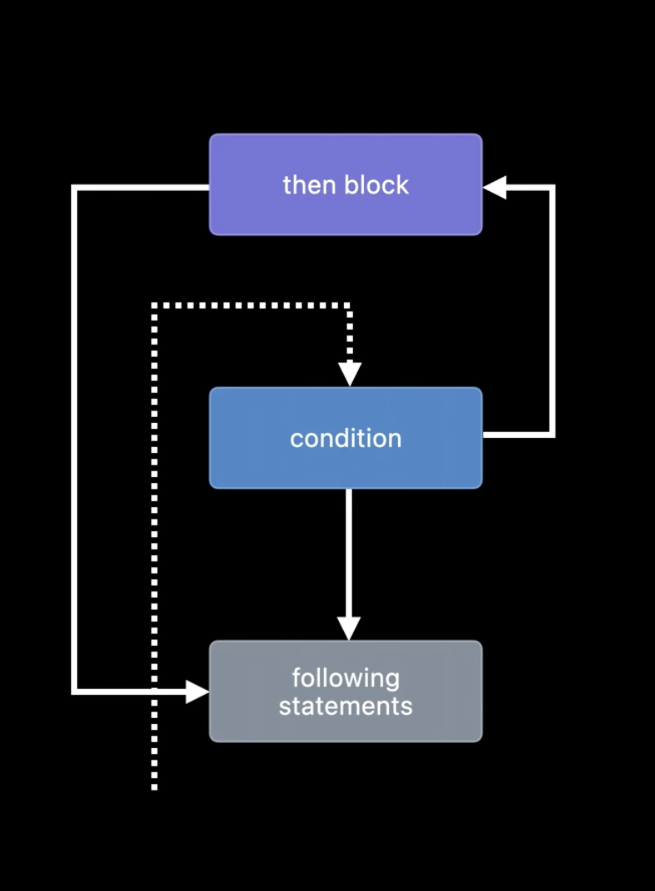

- We dont see that today because languages use structured programming to make control flow more uniform.

- For example the if/else statement uses Structured Control Flow and it specifies that a nested block of code is only conditionaly executed while moving from top to bottom.

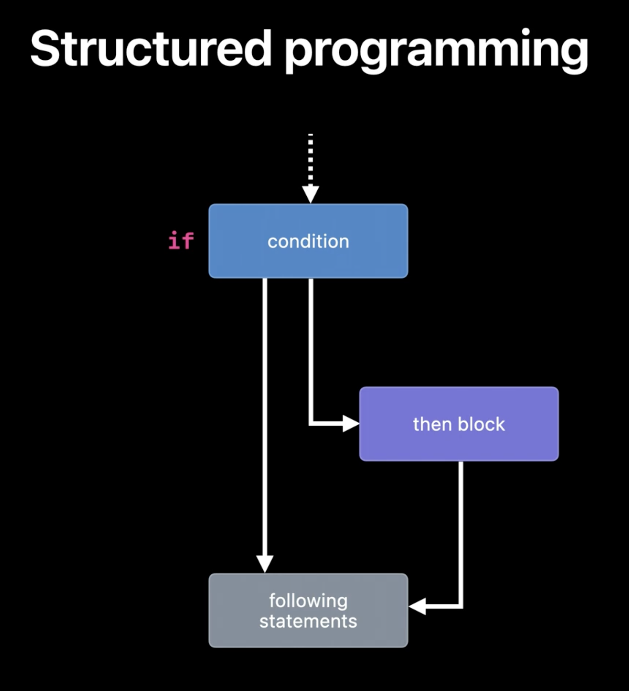

- In Swift that block also respects static Scoping, and it means that the life time of any variable defined in the block will end when leaving the block.

- So Static Programming with Static scope make control flow and variable lifetime easy to understand.

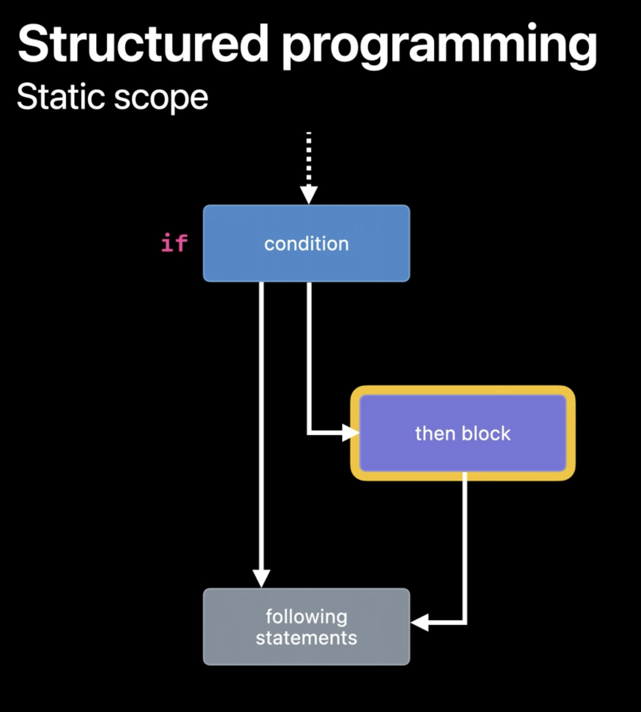

- Structured Control Flow can be Sequenced and Nested together naturally, and this lets you read your entire programm top to bottom.

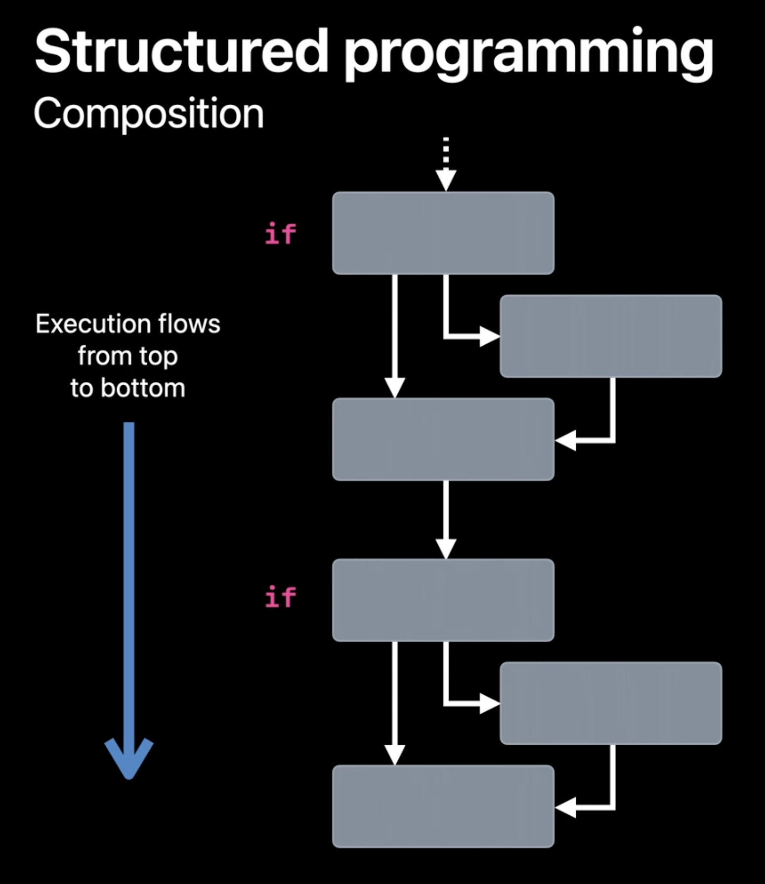

- Today programms featrue async and concurrent code and they have not been able to use structured programming to make that code easier to write.

- First let's consider how Structured Programming makes async code simpler.

- If we want to fetch a lot of images and resize them to be thumbnails sequentialy.

- This code does that asynchronously taking a collection of Strings that Identify the images.


- This function does not return a value when called that is because the function passes its result or error to a `completion handler` it was given and this alows us to recive an answer at a later time.

- As a consequence of that pattern this function can not use Structured control flow for error handling, and that is because it only makes sense to handle errors thrown out of a function not in to one.

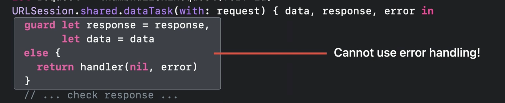

- It also prevents you to use a loop to process each thumbnail and recursion is required because the code that runs after the function completes must be nested within the completion handler.

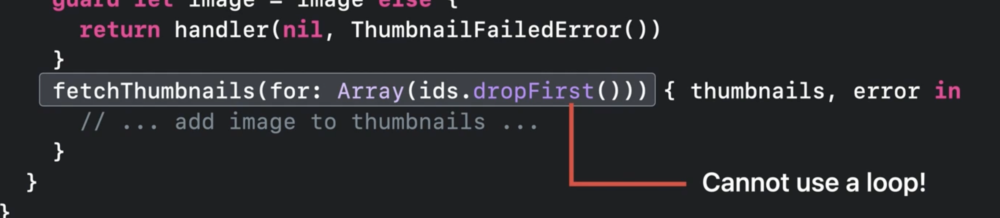

- This is the new code written using async/await which is based on Structured Programming.

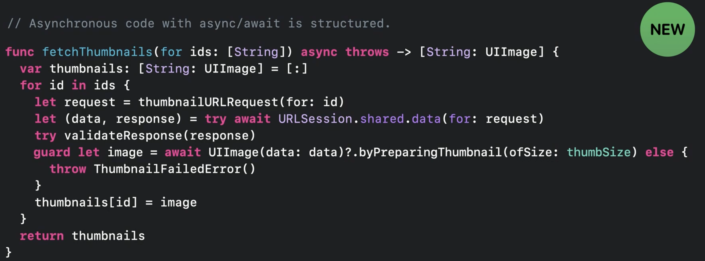

- We replaced the completion handler from the function with `async throws -> [String: UIImage]` in its type signature and it also returns a value insted of nothing.

- In the body of the function we use `await` to say that an asynchronous action happens and no nesting is required for the code that runs after that action.

- We can now loop over the thumbnails to process them sequentialy and we can also throw and catch errors `throw ThumbnailFailedError()` and the compiler will check that we did not forget.

- If we want to process thumbnails for thousents of images it is no longer ideal and even if we have to download its dimensions from another URL insted of being a fixed size?

- Now it is the oportunity to add some concurrency so multiple downloads can happen in paralel.

- You can create aditional tasks to add concurrency to a program.

- `Tasks` are a new feature in swift that work hand in hand with `async` functions.

- A `Task` provides a fresh execution context to run `async code`.

- Each task runs concurrently with respect to other execution context.

- They will be automatically scheduled to run in paralel when it is safe and efficient to do so.

- Because tasks are deeply integrated into swift the compiler can help to prevent some concurrency bugs.

- Calling an `async` function does not create a new `Task` for the call, you can only create them Explicitly.

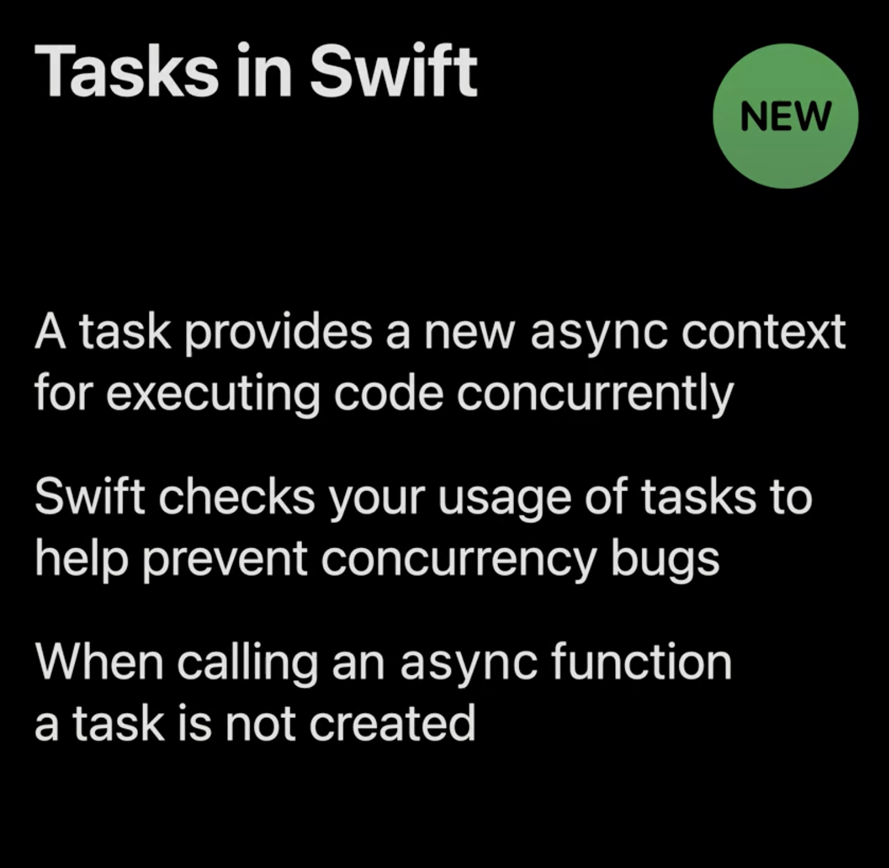

- There are a fiew different flavors of `Tasks` in Swift, because structured concurrency is about the balance between `Flexibility` and `Simplicity`.


## Async-let tasks

- Are the simplest and are created with a new syntatic for called `async let` binding.

- To better understand it we need to break down the ordinary `let` binding.

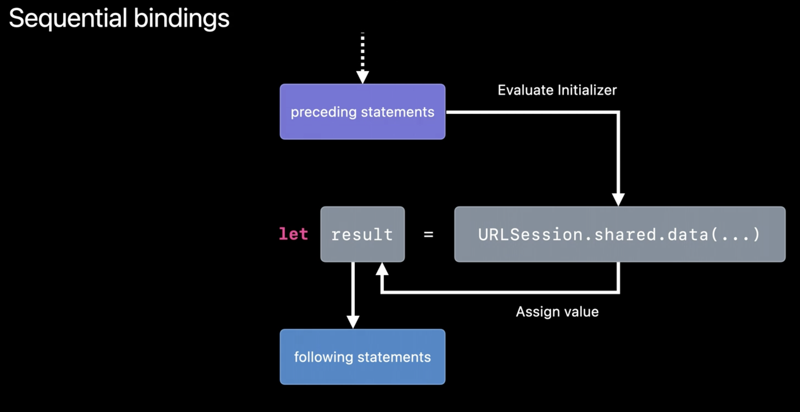

- In an ordinary `let` binding there are two parts: 

1. The initializer expresion on the right part `URLSession.shared.data(...)` 
2. The variable name on the left `result`

- There may be other statements before and after the `let`.

- Once Swift reaches a `let` binding, it's initializer will be evaluated to produce a value, and in our example it means to download data from the URL which could take a while.

- After the data has been downloaded Swift will bind that value to the variable name before proceeding to the next statement that follows.

- We have only one flow of execution here presented by the arrows for each step.

- Since the Download could take a while you want the program to start downloading the data and keep doing other work until the data is actualy needed.

- To archive this we add the word `async` before the existing `let` binding and this turns it into a concurrent binding called an `async let`.

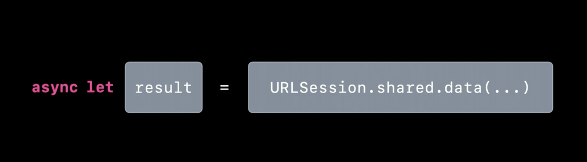

- The evaluation of a `concurrent binding` is different from a `sequential binding`.

- We will start at the point before encountering the binding, than to evaluate a concurrent binding Swift will first create a new child Task which is a subtask of the one that created it.

- Because every Task represents an execution context for your program, two arrows will come out form this step.

- The first arrow is for the child task which imediatly will begin to download the data.

- The second arrow is for the parent task which will imediately bind the variable result to the placeholder value.

- This `Parent Task` is the same one that was executing the `preciding statements`

- While the data is being downloaded concurrently by the `child task`, the `parent task` continue to execute the statements that follow the concurrent binding.

- But when we reach an expresion that needs the actual value of the `result` the parent will `await` the completion of the child task which will fullfill the placeholder for `result`.

- In this example our call to the URLSession can also throw an error and this means that awaiting the result might give us an error so we need to write `try await` to take care of that.

- Also reading the value of `result` again will not recompute it's value.

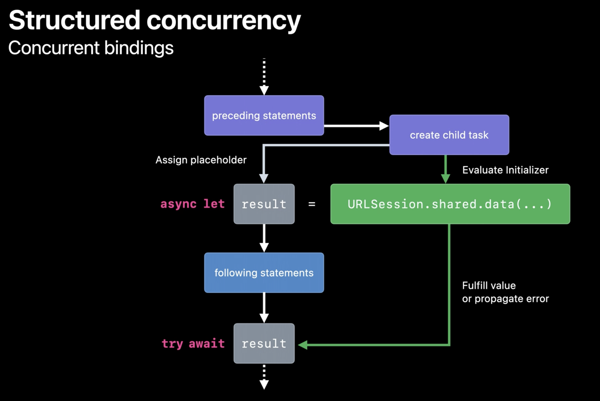

- We can use it to add concurrency to the thumbnail fetching code.

- We refactored a piece of the previous code that fetches a single image in it's own function.

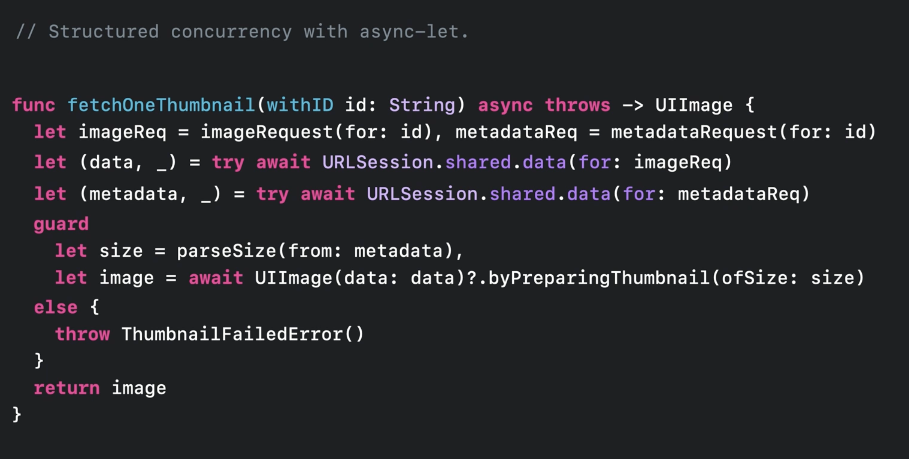

- This new function also downloads data from two different URL's, one for the full size image and the other for the metadata which contains the optimal thumbnail size.

- With a sequential binding you write `try await` on the right side of the let because there is where an error will be observed.

- To make both download happen concurrently we write `async` before both `let` and since now the download are happening in child tasks, the parent task is observing for the error when we use the variables that are concurrently bound.

- Now we write `try await` before the expresion reading the metadata and the image data.

- Also using this concurrently bound variables does not require a method call or any other changes they have the same type that they did in the sequential binding

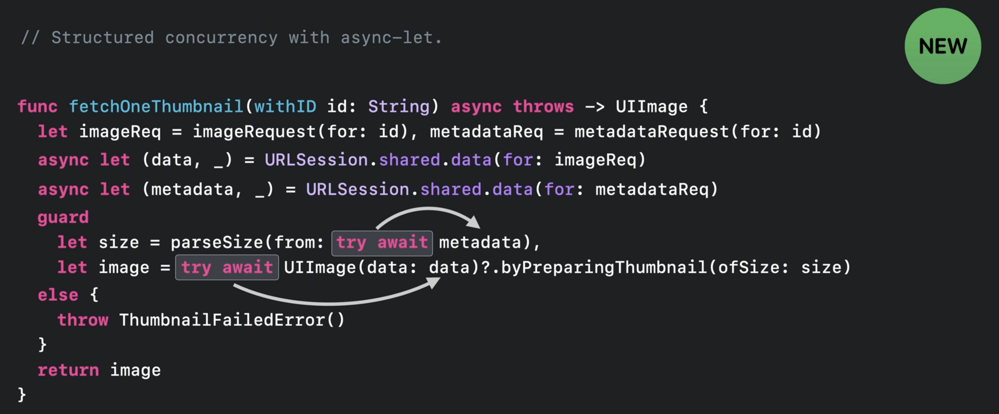

- Now these child tasks that we were talking about are part of a hierarchy called the `Task Tree`.

- This tree is an important part of structured concurrency.

- It influences attributes of your tasks like `cancelation`, `priority`, and `task local variables`.

- Whenever you make a call from one `async` func to another, the same task is used to execute the call.

-  So the function `func fetchOneThumbnail(withID id: String) async throws -> UIImage {...}` inherits all attributes of that task.

- When creating a new structured task with `async let` it becomes the child of the task that the current function is runnig on.

- `Tasks` are not the child of a specific function but their life time may be scoped to it.


- The `Task Tree` is made up by `links` between each parent and its child tasks.

- A `link` enforces a rule that says: A parent task can only finish its work if all of its child tasks are finished.

- This rule holds even in the face of abnormal control flow which will prevent a child task from being awaited.

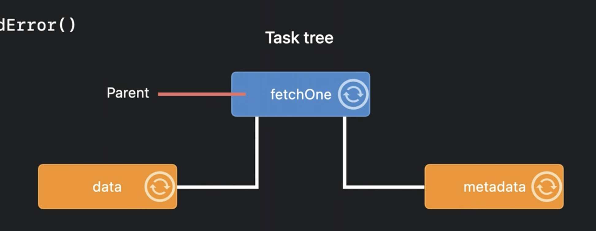

- EX: in the code that we used we first await the metadata task before the image data task, if the first awaited task finishes by throwing an error the `func fetchOneThumbnail` must imediately exit by throwing that error but what will hapen to the task performing the second download?

- During the abnormal exit Swift will automatically mark the un-awaited task as canceled and then await for it to finish before exiting the function.

- Marking a Task as cancelled does not stop the Task, it simply informs the task that the result are no longer needed.

- In fact when a task is cancelled all subtasks that are decendens to that task will be automatically cancelled too.

- So if the implementation of the URLSession creates its own structured tasks to download the image those task will be marked for cancelation.

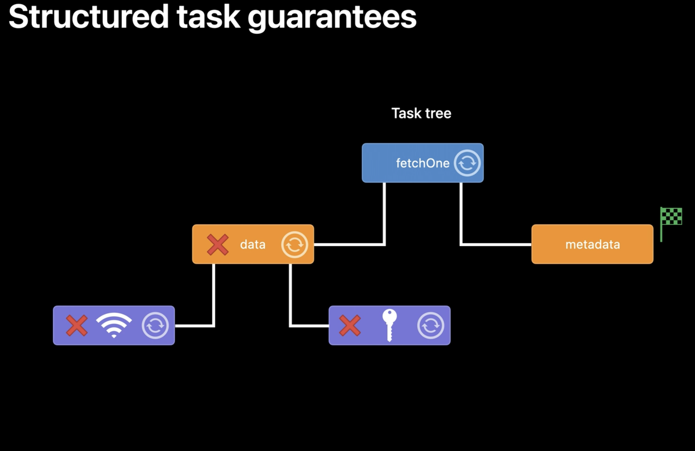

- The function `fetchOneThumbnail` than finaly exits by throwing the error once all of it structured tasks it created directly or indirectly have finished.

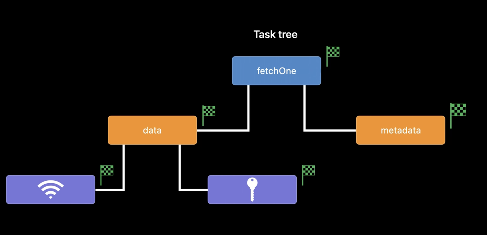

- This is fundamental to Structured Concurrency.

- It prevents you from acidentally liking tasks by helping you managing their lifetimes, similar to how ARC manages the liftime of memory.

- If the task is in the middle of an important transaction or it has open network connection it will be incorrect to halt the task, that is why task cancelation in Swift is co-operative.

- Your code must check for cancelation explicitly and wind down the execution in whatever way it is appropriate.

- You can check the cancelation status of the current task from any function wether it is async or not.

- This means that you should implement your API with cancelation in mind especially if they involve long running computation.

- Your users may call into your code from a task that can be cancelled and they will expect the computation to stop as soon as possible.

- To see it in Action this is the new Method that fetches all the thumbnails:

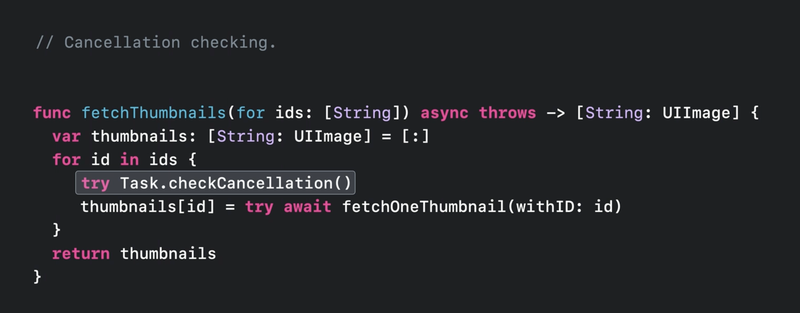

- This function is rewritten so now it uses the `fetchOneThumbnail` function instead.

- If this function was called within a task that it is cancelled we dont wont to hold up our application by creating ussles thumbnails.

- So we can just add a call to check cancellation at the start of each loop operation, and this call only throws an error if the current task has been cancelled.

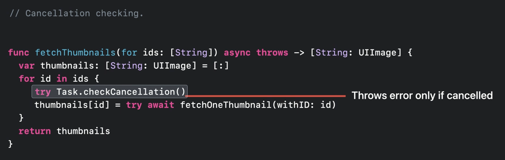

- You can also obtain the cancellatoin status of the current task as a boolean value if it is more appropriate for your code.

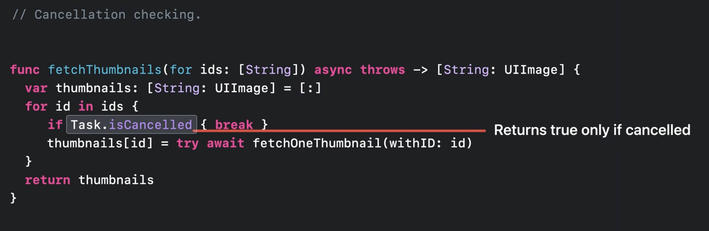

- In this version of the function we are returning a partial result which is a dictionary with only some of the thumbnail requested.

- When you do this you must ensure that your API clearly states that a partial result may be returned.

- Otherwise Task cancelation can trigger a fatal error for your users, because their code requires a complete result even during Cancelation.


## Async-let overview:

- It provides a light weight syntax for adding concurrency to your program while capturing the esence of Structured Programming


## Group Tasks

- They offer more flexibility than the `async let` without giving up all the nice properties of Structured Concurrency.

- Async-let works well when there is a fixed amount of concurrency available.

- Let's consider the functions that we were discussing earlier:

- For each thumbnail id in the loop we called `fetchOneThumbnail` to process it which creates exactly two child tasks one for image data and the other for the metadata.

- Even if we inline the body of this function inside the loop the amount of concurrency will not change.

- Async-let is scoped like a variable binding and that means that the two child tasks must complete before the next loop iteration begins.

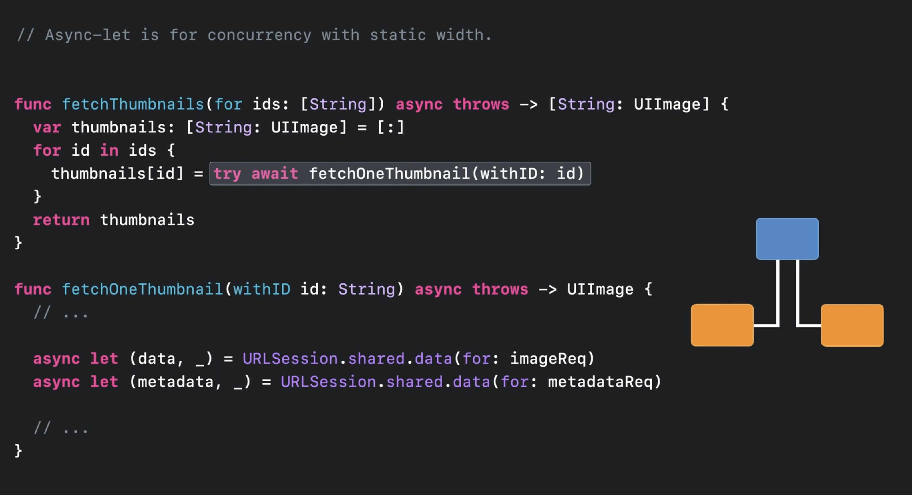

- But what if we want this loop to kick off tasks to fetch all the thumbnails concurrently, then the amount of concurrency is not known statically because it depends on the number of the ID in the array.

- The right tool for this situation is a `Task Group`.

- A `Task Group` is a form of structured concurrency that is designed to provide a dynamic amount of concurrency.

- You can introduce a `Task Group` by calling:

``` swift
try await withThrowingTaskGroup(of: Void.self) { group in
...
}
```

- This function gives you a scope to group object, to create child tasks that are allowed to throw errors.

- Tasks added to a group can not out-live the scope of the block in which the group is defined.

- Since we placed the entire for loop inside of the block, we can now create a dynamic number of tasks using the group.

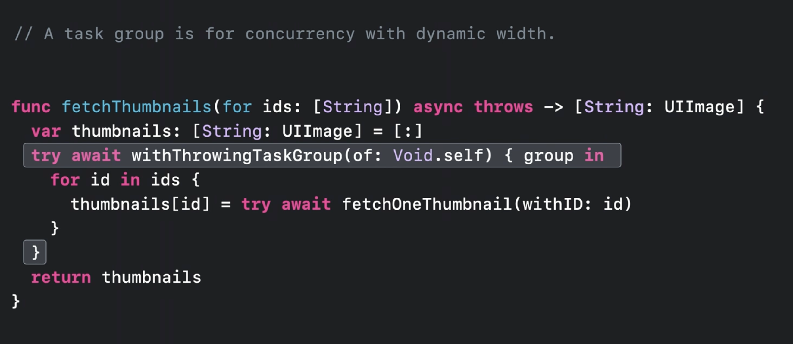

- You create child tasks in a group by invoking its async method, `group.async {`.

- Once added to a group, child tasks begin executing imediately and in any order.

- When the group object goes out of scope the completion with all tasks within it will be implicitly awaited.

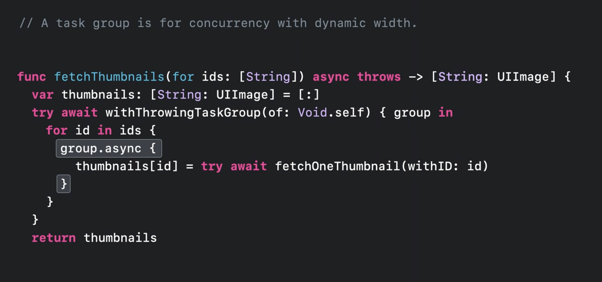

- This is a consequence of the Task-Tree rule we described earlier, because group tasks are structured too.

- At this point we already achived the concurrency that we wanted, one task for each call to fetch one thumbnail which itself will create two more tasks using `Async-let`. 

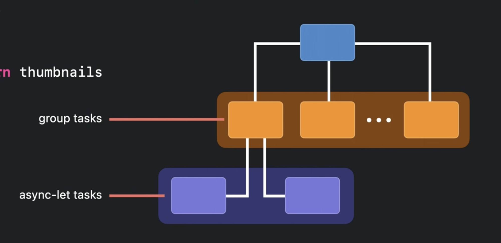

- That is another nice property of structured concurrency, you can use `Async-let` within `Group-Tasks` or create `Task Group` with a `Async-let` tasks and the level of concurrency in the tree compoze naturally.

- If we try to run the current code we will have a data race issue:

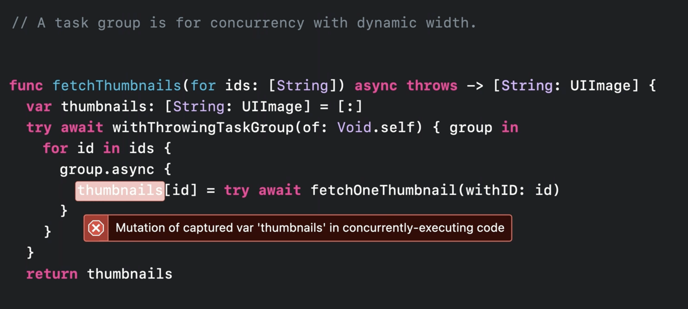

- The problem is that we are trying to insert a thumbnail into a single dictionary from each child task.

- This is a common mistake when increasing the amount of concurrency in your program, data races are created.

- This dictionary can not handel more than one access at a time, and if two child tasks tried to insert thumbails at the same time that can cause a crash or data corruption.

- Swift provides static checking to prevent those bugs from happening in the first place.

- Whenever we create a new task, the work that the tasks perform is within a new closure type called `@Sendable`.

- The body of a `@Sendable` closure is restricted from capturing mutable variables in its lexical context, because those variables can be modified after the task is launch.

- This means that the values that you capture in a task must be safe to share.

- EX: Because they are value types like Int and String or because they are objects designed to be accessed from multiple threads like Actors and Classes that implement their own syncronization.

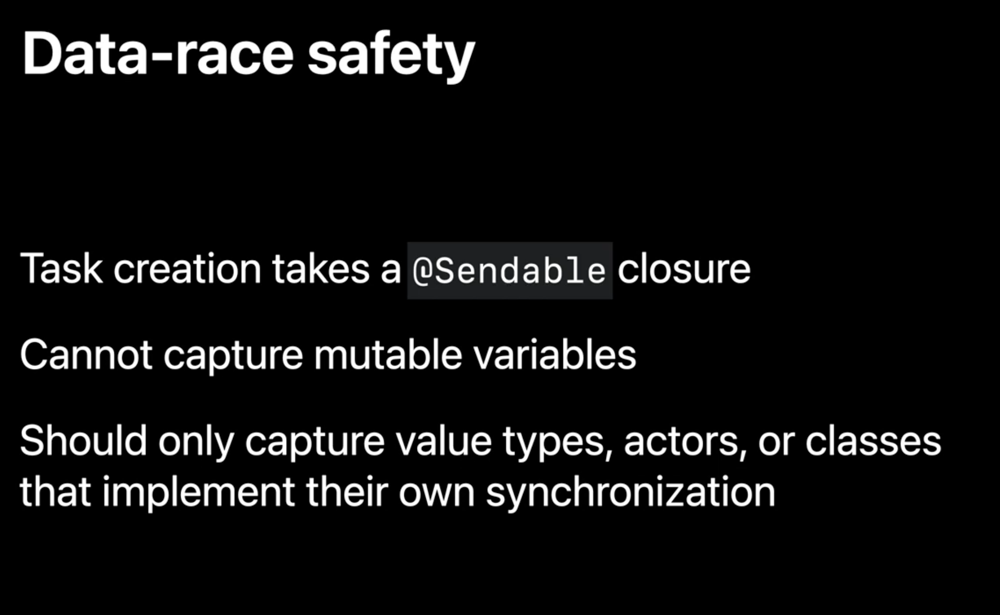

- To avoid the data race in our example you can have each child task return a value.

- This design gives the parent task the responsibility of processing the result.

- In this case we specify that each child task must return a Tuple containing the String id and UIImage for the thumbnail.

- Then inside each child task instead of writing to the dictionary directly we return the key-value tuple for the parent to process.

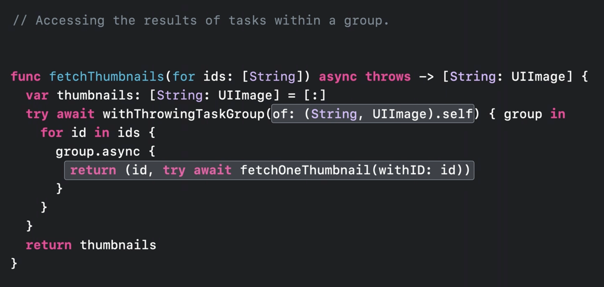

- The parent task can iterate throught the result of each child task usign the new `for try await` loop which obtains the result from the child tasks in order of completion.

- Because this loop runs sequentially, parent tasks can safely add each key-value pair to the dictionary.

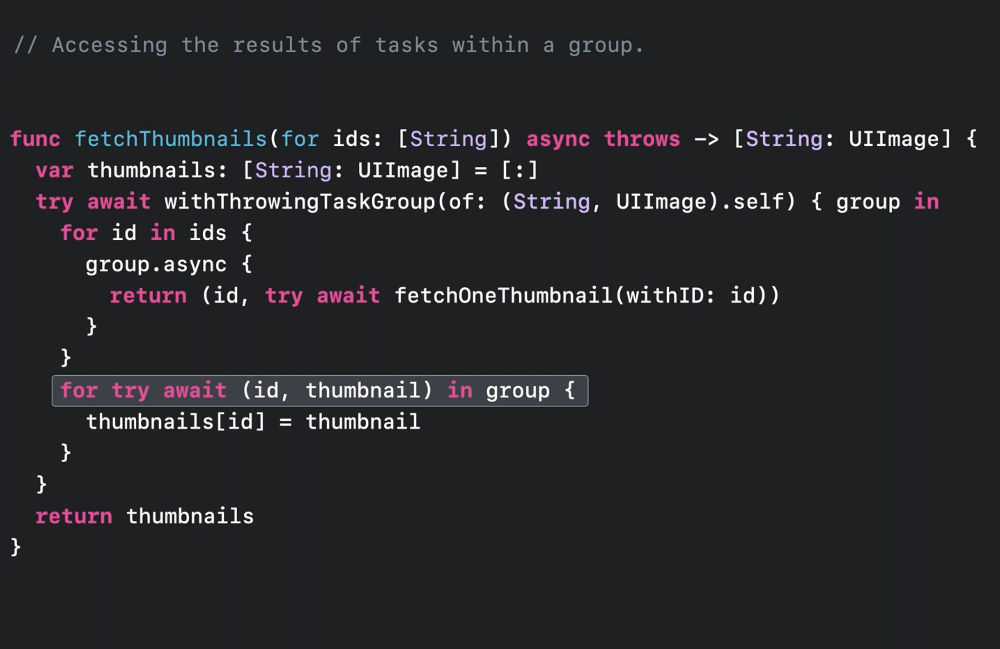

- This is just one example of using the `for try await` loop to access an asynchronous sequence of values, if you type conforms to the `AsyncSequence` protocol that you can use `for try await` to iterate through them too.

- While task groups are a form of structured concurrency there is a small diference on how the Task-Tree rules is implemented for `Group Tasks` versus the `Async-let` tasks.

- If we are iterating through the results of this group and we encounter a child task that completed with an error and because that error is thrown out of the group block all tasks in the group will be implicitly canceled and than awaited.

- Until this point it is similar to the `Async let`.

- The differenc comes when your group goes out of scope through a normal exit from the block, then cancelation is not implicit.

- This behaviour makes it easier for you to express the fork join pattern using a Task-Group, because the jobs will only be awaited not canceled.

- You can also manually cancel all tasks before exiting the block using the group `cancelAll` method.

- No mater how you cancel a task, cancelation automatically propagates down the tree.

- `Async-let` and `Group-Tasks` are the two kind of tasks that provide scoped structured tasks in Swift.


## Overview - Structured Concurrency

- Simplifies error propagation and cancellation
- It has a clear hierarchy to the tasks 


## Unstructured Tasks

- Give you more flexibility at the cost of more manual management.

- There are a lot of situations where a class might not fall into an hierarchy.

- We might not have a parent task at all, if you lunch a task to run async computation from non-async code.

- The lifetime you want for a task might not be related to a single scope or a single function.

- EX: We might want to start a task to response of a method call that puts the object into an active state and then cancel its execution in response to another method call that deactivates the object.

- This comes up when implementing delegate objects in AppKit and UIKit.

- UI work has happen on the main thread, and Swift ensures this by adding `@MainActor`.

- Let's say we have a CollectionView and we can not yet use the CollectionViewDataSource API's, instead we want to use the Thumbnail method that we wrote to grab thumbnails from the network as the items in the CollectionView are displayed.

- The delegate method is not async so we can not use an await call, we need a sort of task for that.

- That task is an extension of the work we started and a response to the delegate action.

- We want this new task to still run on the `@MainActor` with UI priority, we just dont want to bind the lifetime of the task to the scope of a single delegate method.

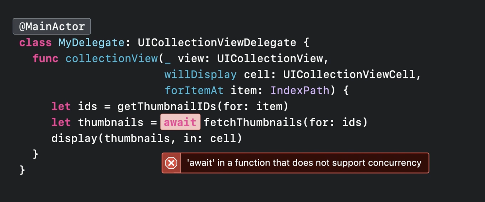

- In situations like this Swift allows us to create an `Unstructured-Task`, so we move the async part of the code into a closure and then pass that closure to construct an async Task.

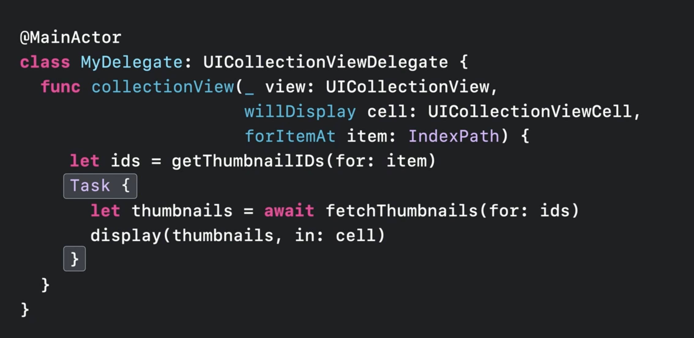

- In the Main thread when we reach the point of creating the Task, Swift will schedule it to run on the same Actor as the originating scope which is the `@MainActor` in this case.

- Meanwhile control returns imediately to the caller.

- The thumbnail Task will run on the Main-thread when it is an opening to do so without blocking the Main-thread on the delegate method.


- Constructing tasks this way gives us a half-way point between Structured and Unstructured code.

- A directly constructed task still inherits the Actor if any in its launch context and it also inherits the priority another trait of the origin task, like an Group-Task or an Async-let would do.

- But the new task is unscoped, and it's life time is not bound by the scope it was launched.

- The origin does not need to be Async, we can create an unscoped task anywhere.

- In trait for all this flexibility we must manually manage the things that the Structured Concurrecny will have handled automatically.

- Cancelation and Errors will not automatically propagate and the task result will not be implicitly awaited unles we take explicit action to do so.


- So we started a task to fetch thumbnails when a collection view item is displayed, and we should also cancel that task if the item is scrolled out of the view before the thumbnail is ready.

- Since we are working with an Unscoped-Task that cancelation is not automatic.

- So after we construct the task we can save the value we get, and we can put this value into a dictionary and its key will be the row index (IndexPath) when we create the task so we can use it later to cancel the task.

- We should also remove it from the dictionary once the task finishes so we don't try to cancel a task that is already finished.

- We can access the same dictionary inside and outside that async task without getting a data race by the compiler.

- Our delegate class is bound to the `@MainActor` and the new task inherits that so they will never run together in paralel.

- We can safely access the stored properties of the `@MainActor` bound classes inside this task without worring about data races.


- Meanwhile if our delegate is latter told that the same table row is removed from display than we can call the `.cancel()` method to cancel the task.


- So we have seen that the Unstructured-Tasks run independent of the scope while still inheriting traits from the task originatig context.

- But some time we don't want to inherit anything form the originatig context, so for maximum flexibility Swift provides `Detached-Tasks`.


## Detached-Tasks

- Like the name sugests Detached-Tasks are independent from their context.

- They are still unstructured tasks, their lifie time is not bound to the originatig scope but they dont pick anything up from the originating scope either.

- By default they are not constrained to the same actor and dont have to run at the same priority as they were launched.

- Detached-Tasks run independently with Generic defaulft for things like priority.

- They can also be launched with option parameters that control how and where the new task gets executed.

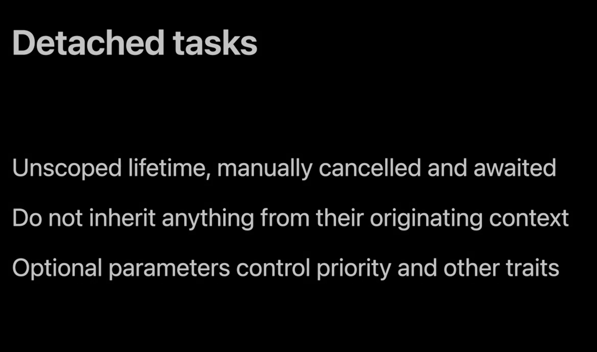

- After we fetch the thumbnails from the server we want to write them to a local disk chache so we don't do another network call if we try to fetch them latter.

- That caching does not need to happen on the `@MainActor`, and even if we cancel fetching all the thumbnails it is helpful to cache any thumbnail we did get form the network.

- We can start caching by using a Detached-Task.

- When we Detached-Tasks we get more flexibility on setting how that task is executed.

- Caching should happen at a lower priority `(priority: .background)` but that does not interfer with the main UI, and we can specify it as background priority then we detach the Task.

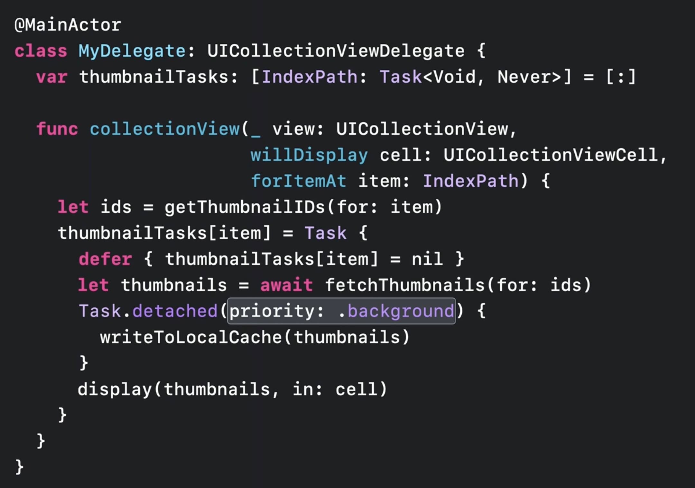

- What should we do in the future if we have multiple background tasks we want to perform on our thumbnail.

- We can use Structured Concurrency inside our Detached-Task.

- We can combine all the different kind of tasks together to exploit each of their strength.

- Instead of detaching an independent Task for every background job we can set up a task group as use each background job as a child task into that group.

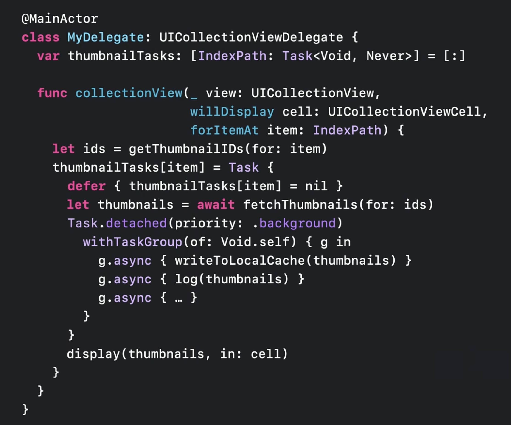

- There are a number of benefits by doing so.

- If we need to cancel a background task in the future, using a task group means you can cancel all of the child tasks just by canceling the Top level Detached-Task and that cancelation will then propagate to the child tasks automatically.

- Further more child tasks automaticaly inherit from the priority of their parent.

- To keep all this work in the background we only need to background the Detached-Task and it will propagate to the all child tasks.

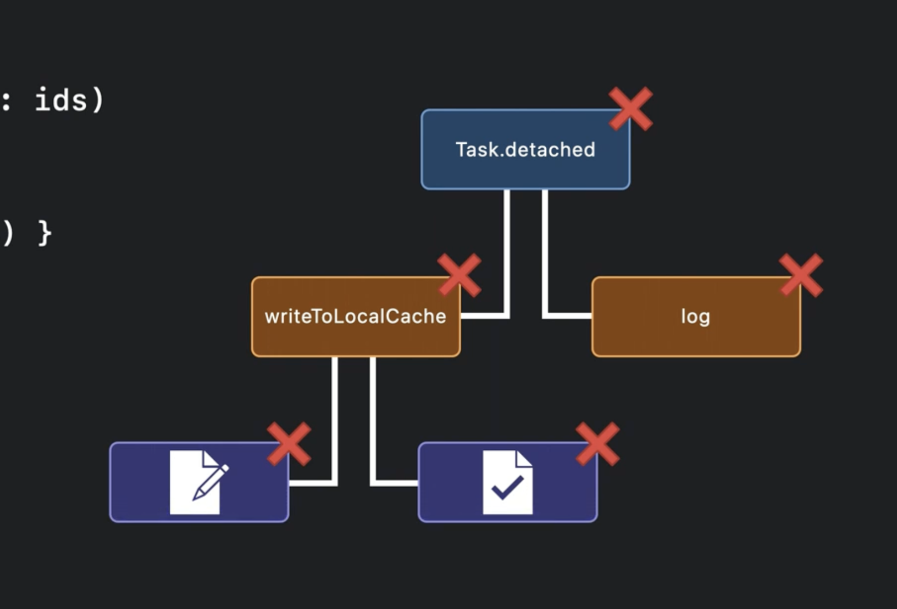

- At this point this are all the forms of Tasks in Swift:

1. `Async let` allows for a fixed number of child tasks to be used as vaiable bindings with automatic management of Cancellation and Error propagation if the binding goes out of the scope.

2. `Task-Group` is used when we need a dynamic number of child tasks that are still bound to a scope we can move up to the Task-Group.

3. `Unstructured-Tasks` if we need to break off some work that is not well scoped which is still related to the originating task we can construct Unstructured-Tasks but we need to manually manage them.

4. `Detached-Tasks` are used for maximum flexibility, and are manually managed tasks that dont inherit anything from their origin.

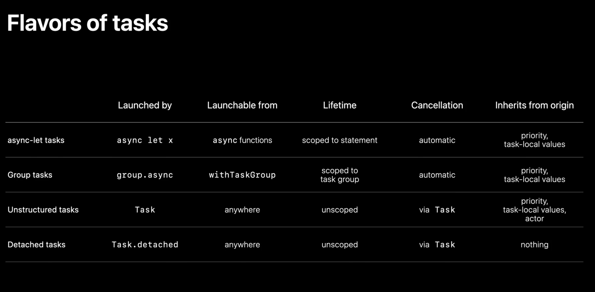
